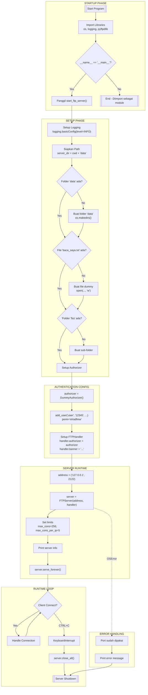
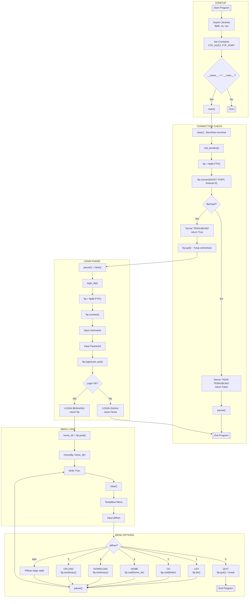
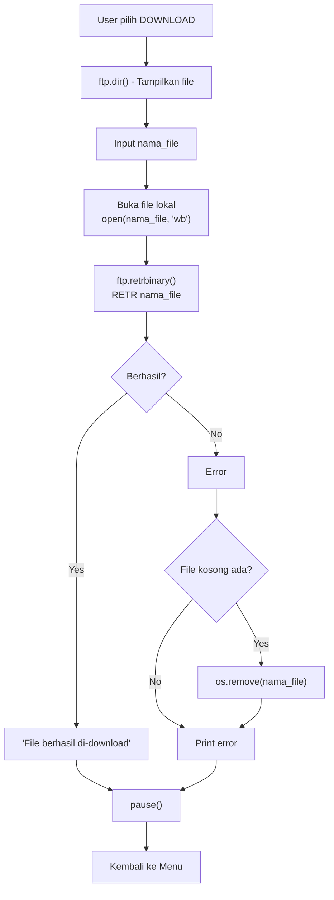
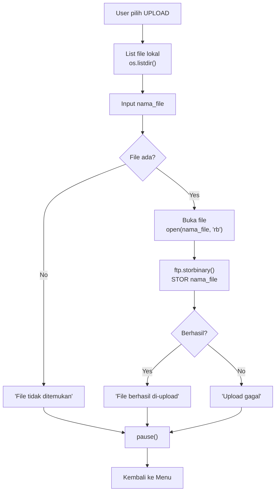
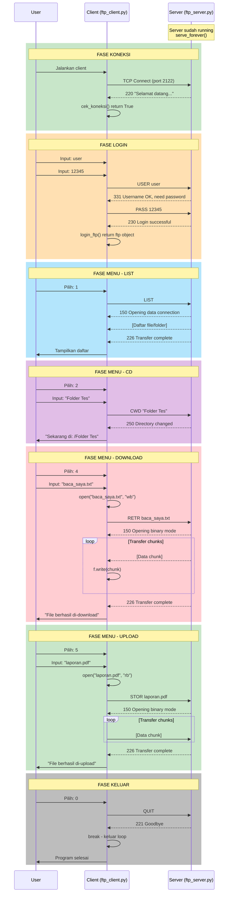

# Dokumentasi Program FTP - Penjelasan Blok per Blok

> **Dibuat untuk persiapan presentasi tanya jawab praktikum**  
> Program: FTP Server & Client menggunakan Python

---

## Daftar Isi
1. [FTP Server - Penjelasan Blok](#ftp-server-ftp_serverpy)
2. [FTP Client - Penjelasan Blok](#ftp-client-ftp_clientpy)
3. [Diagram Alur Mermaid](#diagram-alur-mermaid)
4. [Ringkasan Konsep](#ringkasan-konsep)
5. [Latihan Tanya Jawab](#latihan-tanya-jawab-dengan-dosen)

---

# FTP SERVER (`ftp_server.py`)

## BLOK 1: Import Library (Line 1-5)

```python
import os
import logging
from pyftpdlib.authorizers import DummyAuthorizer
from pyftpdlib.handlers import FTPHandler
from pyftpdlib.servers import FTPServer
```

| Import | Fungsi |
|--------|--------|
| `os` | Library bawaan Python untuk operasi sistem (file, folder) |
| `logging` | Library bawaan untuk mencatat log aktivitas |
| `DummyAuthorizer` | Class untuk mengatur autentikasi user FTP |
| `FTPHandler` | Class untuk menangani koneksi FTP |
| `FTPServer` | Class untuk membuat server FTP |

**Catatan:** `pyftpdlib` adalah library eksternal yang harus diinstall dengan `pip install pyftpdlib`

---

## BLOK 2: Definisi Fungsi Utama (Line 7-10)

```python
def start_ftp_server():
    # --- 1. Konfigurasi Logging ---
    logging.basicConfig(level=logging.INFO)
```

| Komponen | Penjelasan |
|----------|------------|
| `def` | Keyword untuk mendefinisikan fungsi |
| `start_ftp_server()` | Nama fungsi (tanpa parameter) |
| `logging.basicConfig()` | Mengatur level logging ke INFO (menampilkan aktivitas server) |

---

## BLOK 3: Setup Folder Penyimpanan (Line 16-24)

```python
    # --- 2. Menyiapkan Folder Server ---
    share_folder_name = "data"
    current_dir = os.getcwd()
    server_dir = os.path.join(current_dir, share_folder_name)

    # Buat folder utama 'data' jika belum ada
    if not os.path.exists(server_dir):
        os.makedirs(server_dir)
        print(f" [+] Folder penyimpanan dibuat: {share_folder_name}")
```

| Variabel/Statement | Penjelasan |
|--------------------|------------|
| `share_folder_name = "data"` | Assignment: menyimpan nama folder ke variabel |
| `os.getcwd()` | Mendapatkan direktori kerja saat ini |
| `os.path.join()` | Menggabungkan path (cross-platform) |
| `os.path.exists()` | Mengecek apakah path sudah ada |
| `os.makedirs()` | Membuat folder (termasuk parent jika perlu) |
| `if not ...` | Conditional statement: jika folder TIDAK ada |

---

## BLOK 4: Membuat File Dummy untuk Tes (Line 26-31)

```python
    # Buat file dummy 'baca_saya.txt' untuk tes download
    dummy_file = os.path.join(server_dir, "baca_saya.txt")
    if not os.path.exists(dummy_file):
        with open(dummy_file, "w") as f:
            f.write("Halo! Ini adalah file tes dari server.\nSilakan download file ini.")
        print(" [+] File 'baca_saya.txt' dibuat otomatis.")
```

| Komponen | Penjelasan |
|----------|------------|
| `with open(..., "w") as f:` | Context manager untuk membuka file mode write |
| `f.write(...)` | Menulis string ke file |
| `\n` | Karakter newline (baris baru) |

**Mengapa pakai `with`?** File otomatis ditutup setelah blok selesai, lebih aman dari memory leak.

---

## BLOK 5: Membuat Sub-folder untuk Tes Navigasi (Line 33-37)

```python
    # Buat sub-folder 'Folder Tes' untuk tes navigasi
    sub_folder = os.path.join(server_dir, "Folder Tes")
    if not os.path.exists(sub_folder):
        os.makedirs(sub_folder)
        print(" [+] Sub-Folder 'Folder Tes' dibuat.")
```

Sama seperti BLOK 3, membuat folder untuk user bisa test navigasi direktori.

---

## BLOK 6: Konfigurasi Autentikasi User (Line 41-46)

```python
    # --- 3. Konfigurasi User (Authorizer) ---
    authorizer = DummyAuthorizer()
    
    # Menambahkan user: username='user', password='12345'
    authorizer.add_user("user", "12345", server_dir, perm="elradfmw")
```

| Komponen | Penjelasan |
|----------|------------|
| `DummyAuthorizer()` | Membuat objek authorizer (pengelola user) |
| `add_user(username, password, homedir, perm)` | Menambahkan user baru |
| `perm="elradfmw"` | Permission string (lihat tabel di bawah) |

**Permission String `elradfmw`:**
| Huruf | Arti | Perintah FTP |
|-------|------|--------------|
| `e` | change directory | CWD, CDUP |
| `l` | list files | LIST, NLST |
| `r` | retrieve (download) | RETR |
| `a` | append data | APPE |
| `d` | delete | DELE, RMD |
| `f` | rename | RNFR, RNTO |
| `m` | make directory | MKD |
| `w` | write (upload) | STOR, STOU |

---

## BLOK 7: Setup Handler & Konfigurasi Server (Line 48-54)

```python
    # --- 4. Handler & Server ---
    handler = FTPHandler
    handler.authorizer = authorizer
    handler.banner = "Selamat datang di Local FTP Server (Python)"

    # Konfigurasi IP dan Port
    address = ("127.0.0.1", 2122)
```

| Komponen | Penjelasan |
|----------|------------|
| `handler = FTPHandler` | Mengambil class FTPHandler (bukan instance) |
| `handler.authorizer` | Menghubungkan authorizer ke handler |
| `handler.banner` | Pesan selamat datang saat client connect |
| `address` | Tuple berisi (IP, Port) |
| `127.0.0.1` | Localhost (hanya bisa diakses dari komputer ini) |
| `2122` | Port non-standar (port 21 butuh root access) |

---

## BLOK 8: Try Block - Menjalankan Server (Line 56-69)

```python
    try:
        server = FTPServer(address, handler)
        server.max_cons = 256        # Maksimal koneksi
        server.max_cons_per_ip = 5   # Maksimal koneksi per IP

        print("="*60)
        print(" SERVER SIAP MENERIMA KONEKSI")
        print(f" Alamat   : ftp://127.0.0.1:2122")
        print(" User     : user")
        print(" Pass     : 12345")
        print("="*60)
        print(" TEKAN CTRL+C UNTUK MEMATIKAN SERVER")
        
        server.serve_forever()  # Jalankan server terus menerus
```

| Komponen | Penjelasan |
|----------|------------|
| `try:` | Memulai blok try untuk menangani error |
| `FTPServer(address, handler)` | Membuat instance server FTP |
| `max_cons` | Limit maksimal koneksi simultan |
| `max_cons_per_ip` | Limit koneksi dari 1 IP (anti-abuse) |
| `serve_forever()` | **Loop tak terbatas** - server terus berjalan |

---

## BLOK 9: Except Block - Penanganan Error (Line 71-76)

```python
    except OSError as ex:
        print(f" Gagal start server: {ex}")
        print(" Pastikan port 2122 tidak sedang dipakai aplikasi lain.")
    except KeyboardInterrupt:
        server.close_all()
        print("\n\n Server dimatikan.")
```

| Exception | Kapan Terjadi | Penanganan |
|-----------|---------------|------------|
| `OSError` | Port sudah dipakai, permission denied | Tampilkan pesan error |
| `KeyboardInterrupt` | User tekan CTRL+C | Tutup semua koneksi, keluar |

---

## BLOK 10: Entry Point (Line 78-79)

```python
if __name__ == "__main__":
    start_ftp_server()
```

**Penjelasan:**
- `__name__` adalah variabel spesial Python
- Bernilai `"__main__"` jika file dijalankan langsung
- Bernilai nama module jika di-import dari file lain
- **Fungsi:** Memastikan `start_ftp_server()` hanya dipanggil saat file dijalankan langsung

---

# FTP CLIENT (`ftp_client.py`)

## BLOK 1: Import & Konstanta (Line 1-7)

```python
import ftplib
import os
import sys

# Konfigurasi Koneksi
FTP_HOST = "127.0.0.1"
FTP_PORT = 2122
```

| Import/Variabel | Penjelasan |
|-----------------|------------|
| `ftplib` | Library bawaan Python untuk FTP client |
| `os` | Operasi sistem (file, terminal) |
| `sys` | Interaksi dengan Python interpreter |
| `FTP_HOST` | Konstanta: alamat IP server |
| `FTP_PORT` | Konstanta: port server |

**Catatan:** Variabel dengan nama HURUF_BESAR biasanya adalah konstanta (tidak berubah).

---

## BLOK 2: Fungsi Utilitas (Line 9-17)

```python
def clear():
    # Membersihkan layar terminal
    os.system("cls" if os.name == "nt" else "clear")

def garis():
    print("="*60)

def pause():
    input("\nTekan ENTER untuk lanjut...")
```

| Fungsi | Tujuan |
|--------|--------|
| `clear()` | Membersihkan terminal (cls untuk Windows, clear untuk Linux/Mac) |
| `garis()` | Mencetak garis pembatas 60 karakter |
| `pause()` | Menunggu user menekan ENTER |

**Ternary Operator:** `"cls" if os.name == "nt" else "clear"`
- Jika `os.name` = "nt" (Windows) maka gunakan "cls"
- Jika tidak (Linux/Mac) maka gunakan "clear"

---

## BLOK 3: Fungsi Cek Koneksi (Line 19-33)

```python
def cek_koneksi():
    garis()
    print(" CEK KONEKSI FTP SERVER")
    garis()
    try:
        ftp = ftplib.FTP()
        ftp.connect(FTP_HOST, FTP_PORT, timeout=5)
        print(" [STATUS] Server FTP TERHUBUNG")
        ftp.quit()  # Tutup koneksi sementara
        return True
    except Exception as e:
        print(" [STATUS] Server FTP TIDAK TERHUBUNG")
        print(f" Error: {e}")
        return False
```

| Komponen | Penjelasan |
|----------|------------|
| `ftplib.FTP()` | Membuat objek FTP (belum terkoneksi) |
| `ftp.connect(host, port, timeout)` | Mencoba koneksi ke server |
| `timeout=5` | Maksimal 5 detik menunggu koneksi |
| `ftp.quit()` | Menutup koneksi dengan baik |
| `return True/False` | Mengembalikan status koneksi |
| `Exception as e` | Menangkap semua jenis error |

---

## BLOK 4: Fungsi Login (Line 35-55)

```python
def login_ftp():
    ftp = ftplib.FTP()
    try:
        ftp.connect(FTP_HOST, FTP_PORT)
        print("\n LOGIN FTP")
        user = input(" Username: ")
        pwd = input(" Password: ")
        
        ftp.login(user, pwd)
        print(" [LOGIN BERHASIL]")
        print(" Pesan Server:", ftp.getwelcome())
        return ftp
    except Exception as e:
        print("\n [LOGIN GAGAL]")
        print(f" Error: {e}")
        try:
            ftp.quit()
        except:
            pass
        return None
```

| Komponen | Penjelasan |
|----------|------------|
| `input(...)` | Menerima input dari keyboard |
| `ftp.login(user, pwd)` | Mengirim USER dan PASS ke server |
| `ftp.getwelcome()` | Mengambil banner/pesan dari server |
| `return ftp` | Mengembalikan objek koneksi (jika berhasil) |
| `return None` | Mengembalikan None (jika gagal) |

---

## BLOK 5: Fungsi Menu Utama - Header (Line 57-72)

```python
def menu(ftp, home_dir):
    while True:
        clear()
        print(" MENU CLIENT FTP")
        garis()
        print(f" Direktori saat ini: {ftp.pwd()}")
        garis()
        print(" 1. Cek Direktori Server (List)")
        print(" 2. Pindah Folder (Change Directory)")
        print(" 3. Kembali ke Awal (Home)")
        print(" 4. Download File")
        print(" 5. Upload File")
        print(" 0. Keluar")
        garis()
        
        pilihan = input(" Pilihan (0-5): ")
```

| Komponen | Penjelasan |
|----------|------------|
| `def menu(ftp, home_dir):` | Fungsi dengan 2 parameter |
| `while True:` | Loop tak terbatas (keluar dengan break) |
| `ftp.pwd()` | Print Working Directory - direktori saat ini |
| `pilihan = input(...)` | Menyimpan pilihan user ke variabel |

---

## BLOK 6: Menu 1 - List Direktori (Line 74-81)

```python
        if pilihan == '1':
            # LIST FILE
            print("\n [ISI DIREKTORI SERVER]")
            try:
                ftp.dir()  # Menampilkan daftar file lengkap
            except Exception as e:
                print(f" Gagal mengambil list: {e}")
            pause()
```

| Komponen | FTP Command | Penjelasan |
|----------|-------------|------------|
| `ftp.dir()` | LIST | Menampilkan detail file (permission, size, date, name) |

---

## BLOK 7: Menu 2 - Pindah Folder (Line 83-91)

```python
        elif pilihan == '2':
            # PINDAH FOLDER
            folder = input(" Masukkan nama folder tujuan: ")
            try:
                ftp.cwd(folder)  # Change Working Directory
                print(f" [BERHASIL] Sekarang di: {ftp.pwd()}")
            except Exception as e:
                print(" [GAGAL] Folder tidak ditemukan.")
            pause()
```

| Komponen | FTP Command | Penjelasan |
|----------|-------------|------------|
| `ftp.cwd(folder)` | CWD | Change Working Directory |

---

## BLOK 8: Menu 3 - Kembali ke Home (Line 93-100)

```python
        elif pilihan == '3':
            # KEMBALI KE HOME
            try:
                ftp.cwd(home_dir)
                print(f" [HOME] Kembali ke: {ftp.pwd()}")
            except Exception as e:
                print(f" Gagal: {e}")
            pause()
```

**Penjelasan:** Menggunakan `home_dir` yang disimpan saat login untuk kembali ke direktori awal.

---

## BLOK 9: Menu 4 - Download File (Line 102-119)

```python
        elif pilihan == '4':
            # DOWNLOAD FILE
            print("\n [DOWNLOAD FILE]")
            ftp.dir()  # Tampilkan dulu isinya
            nama_file = input(" Masukkan nama file yang akan di-download: ")
            try:
                with open(nama_file, "wb") as f:
                    ftp.retrbinary(f"RETR {nama_file}", f.write)
                print(" [BERHASIL] File berhasil di-download.")
            except Exception as e:
                print(f" [GAGAL] File tidak dapat di-download: {e}")
                if os.path.exists(nama_file):
                    os.remove(nama_file)  # Hapus file kosong jika gagal
            pause()
```

| Komponen | FTP Command | Penjelasan |
|----------|-------------|------------|
| `open(nama_file, "wb")` | - | Buka file lokal mode write binary |
| `ftp.retrbinary(cmd, callback)` | RETR | Retrieve file dalam mode binary |
| `f"RETR {nama_file}"` | - | F-string: menyisipkan variabel ke string |
| `f.write` | - | Callback: fungsi yang dipanggil untuk setiap chunk data |

**Alur Download:**
1. Server mengirim data dalam chunks
2. Setiap chunk, `f.write` dipanggil
3. Data ditulis ke file lokal

---

## BLOK 10: Menu 5 - Upload File (Line 121-143)

```python
        elif pilihan == '5':
            # UPLOAD FILE
            print("\n [UPLOAD FILE]")
            print(" Daftar File Lokal:")
            lokal_files = [f for f in os.listdir() if os.path.isfile(f)]
            for f in lokal_files:
                print(f" - {f}")
            
            nama_file = input(" Masukkan nama file lokal untuk di-upload: ")
            
            if not os.path.exists(nama_file):
                 print(" [ERROR] File lokal tidak ditemukan.")
            else:
                try:
                    with open(nama_file, "rb") as f:
                        ftp.storbinary(f"STOR {nama_file}", f)
                    print(" [BERHASIL] File berhasil di-upload.")
                except Exception as e:
                     print(f" [GAGAL] Upload gagal: {e}")
            pause()
```

| Komponen | FTP Command | Penjelasan |
|----------|-------------|------------|
| `os.listdir()` | - | List semua file di direktori saat ini |
| `os.path.isfile(f)` | - | Cek apakah `f` adalah file (bukan folder) |
| `[... for ... if ...]` | - | List comprehension dengan filter |
| `open(nama_file, "rb")` | - | Buka file lokal mode read binary |
| `ftp.storbinary(cmd, file)` | STOR | Store/upload file dalam mode binary |

---

## BLOK 11: Menu 0 - Keluar (Line 145-155)

```python
        elif pilihan == '0':
            print(" Menutup koneksi...")
            try:
                ftp.quit()
            except:
                pass
            break
        
        else:
            print(" Pilihan tidak valid.")
            pause()
```

| Komponen | Penjelasan |
|----------|------------|
| `ftp.quit()` | Menutup koneksi FTP dengan benar |
| `break` | Keluar dari loop `while True` |
| `else:` | Jika pilihan bukan 0-5 |

---

## BLOK 12: Fungsi Main (Line 157-172)

```python
def main():
    clear()
    # Step 1: Cek Server
    if not cek_koneksi():
        pause()
        return
    
    pause()
    clear()
    
    # Step 2: Login
    ftp = login_ftp()
    if ftp:
        # Simpan direktori awal sebagai home
        home_dir = ftp.pwd()
        menu(ftp, home_dir)

if __name__ == "__main__":
    main()
```

| Komponen | Penjelasan |
|----------|------------|
| `if not cek_koneksi():` | Jika koneksi gagal, keluar |
| `ftp = login_ftp()` | Simpan hasil login ke variabel |
| `if ftp:` | Jika login berhasil (bukan None) |
| `home_dir = ftp.pwd()` | Simpan direktori awal |
| `menu(ftp, home_dir)` | Panggil menu dengan 2 argument |

---

# Diagram Alur Mermaid

## Flowchart Server



## Flowchart Client



## Flowchart Download



## Flowchart Upload



## Sequence Diagram - Komunikasi Client-Server



---

# Ringkasan Konsep

## Tabel Ringkasan `def`

| Fungsi | File | Parameter | Return | Tujuan |
|--------|------|-----------|--------|--------|
| `start_ftp_server()` | server | - | - | Menjalankan server |
| `clear()` | client | - | - | Bersihkan terminal |
| `garis()` | client | - | - | Cetak pembatas |
| `pause()` | client | - | - | Tunggu ENTER |
| `cek_koneksi()` | client | - | bool | Cek server aktif |
| `login_ftp()` | client | - | FTP/None | Login ke server |
| `menu(ftp, home_dir)` | client | 2 | - | Menu interaktif |
| `main()` | client | - | - | Entry point |

## Tabel Ringkasan Statement

| Statement | Contoh | Fungsi |
|-----------|--------|--------|
| Assignment | `x = 5` | Menyimpan nilai |
| Conditional | `if/elif/else` | Percabangan |
| Loop | `while/for` | Perulangan |
| Try-Except | `try/except` | Error handling |
| Import | `import os` | Import library |
| Return | `return True` | Kembalikan nilai |
| Break | `break` | Keluar loop |

## Tabel Ringkasan FTP Commands

| Python Method | FTP Command | Fungsi |
|---------------|-------------|--------|
| `ftp.connect()` | - | Koneksi TCP |
| `ftp.login()` | USER, PASS | Autentikasi |
| `ftp.pwd()` | PWD | Print working directory |
| `ftp.cwd()` | CWD | Change directory |
| `ftp.dir()` | LIST | List directory |
| `ftp.retrbinary()` | RETR | Download binary |
| `ftp.storbinary()` | STOR | Upload binary |
| `ftp.quit()` | QUIT | Tutup koneksi |

---

# Latihan Tanya Jawab dengan Dosen

## Kategori 1: Pertanyaan tentang `def` (Definisi Fungsi)

### Q1: "Apa itu `def` dalam Python?"
**Jawaban:**
`def` adalah keyword (kata kunci) Python untuk **mendefinisikan sebuah fungsi**. Fungsi adalah blok kode yang dapat digunakan berulang kali untuk melakukan tugas tertentu.

**Contoh dari kode saya:**
```python
def start_ftp_server():   # Mendefinisikan fungsi bernama start_ftp_server
    ...
```

---

### Q2: "Mengapa kita perlu menggunakan fungsi? Kenapa tidak tulis langsung saja?"
**Jawaban:**
1. **Reusability** - Kode bisa dipanggil berulang kali tanpa menulis ulang
2. **Readability** - Kode lebih mudah dibaca dan dipahami
3. **Maintainability** - Jika ada bug, cukup perbaiki di satu tempat
4. **Modularity** - Memecah program besar menjadi bagian-bagian kecil

**Contoh:** Fungsi `pause()` dipanggil berkali-kali di menu client, tidak perlu tulis `input("\nTekan ENTER...")` berulang-ulang.

---

### Q3: "Jelaskan struktur lengkap dari definisi fungsi!"
**Jawaban:**
```python
def nama_fungsi(parameter1, parameter2):    # Header fungsi
    """Docstring - penjelasan fungsi"""     # Opsional
    # Body fungsi
    kode_1
    kode_2
    return nilai                            # Opsional
```

| Bagian | Penjelasan |
|--------|------------|
| `def` | Keyword untuk mendefinisikan fungsi |
| `nama_fungsi` | Nama fungsi (bebas, tapi deskriptif) |
| `(parameter)` | Parameter yang diterima (bisa kosong) |
| `:` | Tanda awal body fungsi |
| Body | Kode yang dijalankan (harus indent) |
| `return` | Mengembalikan nilai (opsional) |

---

## Kategori 2: Pertanyaan tentang Argument & Parameter

### Q4: "Apa bedanya parameter dan argument?"
**Jawaban:**
- **Parameter** = Variabel yang ditulis saat **mendefinisikan** fungsi
- **Argument** = Nilai yang diberikan saat **memanggil** fungsi

**Contoh dari kode saya:**
```python
# PARAMETER (saat definisi)
def menu(ftp, home_dir):    # ftp dan home_dir adalah PARAMETER
    ...

# ARGUMENT (saat pemanggilan)
menu(ftp, home_dir)         # nilai ftp dan home_dir adalah ARGUMENT
```

**Analogi:** Parameter = kotak kosong, Argument = isi kotak.

---

### Q5: "Ada berapa jenis parameter di Python?"
**Jawaban:**
| Jenis | Contoh | Penjelasan |
|-------|--------|------------|
| Positional | `def func(a, b)` | Urutan penting |
| Keyword | `func(b=2, a=1)` | Bisa tukar urutan |
| Default | `def func(a, b=10)` | Ada nilai default |
| *args | `def func(*args)` | Banyak argument |
| **kwargs | `def func(**kwargs)` | Banyak keyword argument |

**Di kode saya:** Hanya menggunakan **positional parameter** seperti `menu(ftp, home_dir)`.

---

### Q6: "Pada fungsi `menu(ftp, home_dir)`, apa yang terjadi jika argument tidak diberikan?"
**Jawaban:**
Python akan menampilkan error:
`TypeError: menu() missing 2 required positional arguments: 'ftp' and 'home_dir'`

Karena `ftp` dan `home_dir` adalah **required parameter** (wajib ada).

---

## Kategori 3: Pertanyaan tentang Fungsi

### Q7: "Sebutkan jenis-jenis fungsi di program Anda!"
**Jawaban:**

**1. Built-in Function (bawaan Python):**
```python
print()      # Menampilkan output
input()      # Menerima input user
open()       # Membuka file
len()        # Menghitung panjang
```

**2. Library Function (dari import):**
```python
os.getcwd()           # Dari library os
ftp.connect()         # Dari library ftplib
logging.basicConfig() # Dari library logging
```

**3. User-defined Function (buatan sendiri):**
```python
def start_ftp_server():  # Di ftp_server.py
def cek_koneksi():       # Di ftp_client.py
def login_ftp():         # Di ftp_client.py
def menu():              # Di ftp_client.py
```

---

### Q8: "Apa fungsi `return` dalam fungsi?"
**Jawaban:**
`return` digunakan untuk **mengembalikan nilai** dari fungsi ke pemanggil.

**Contoh dari kode saya:**
```python
def cek_koneksi():
    ...
    if berhasil:
        return True    # Mengembalikan True
    else:
        return False   # Mengembalikan False

# Penggunaan:
if not cek_koneksi():   # Menerima True/False
    print("Gagal")
```

**Jika tidak ada return:** Fungsi mengembalikan `None` secara default.

---

### Q9: "Jelaskan fungsi `login_ftp()` di kode Anda!"
**Jawaban:**
```python
def login_ftp():                        # Tidak ada parameter
    ftp = ftplib.FTP()                  # Buat objek FTP
    try:
        ftp.connect(FTP_HOST, FTP_PORT) # Koneksi ke server
        user = input(" Username: ")     # Minta username
        pwd = input(" Password: ")      # Minta password
        ftp.login(user, pwd)            # Kirim ke server
        return ftp                      # Return objek FTP jika berhasil
    except:
        return None                     # Return None jika gagal
```

**Alur:**
1. Buat objek FTP kosong
2. Connect ke server
3. Minta input username & password
4. Login ke server
5. Jika berhasil, return objek FTP
6. Jika gagal, return None

---

## Kategori 4: Pertanyaan tentang Statement

### Q10: "Apa itu statement?"
**Jawaban:**
Statement adalah **satu instruksi lengkap** yang dapat dieksekusi oleh Python.

**Contoh statement:**
```python
x = 5                    # Assignment statement
print("Hello")           # Expression statement
if x > 0:                # Conditional statement
    pass
for i in range(10):      # Loop statement
    pass
import os                # Import statement
return True              # Return statement
```

---

### Q11: "Jelaskan conditional statement di kode Anda!"
**Jawaban:**
```python
# Di ftp_client.py - Menu pilihan
if pilihan == '1':
    ftp.dir()                    # Jika user pilih 1
elif pilihan == '2':
    ftp.cwd(folder)              # Jika user pilih 2
elif pilihan == '3':
    ftp.cwd(home_dir)            # Jika user pilih 3
elif pilihan == '4':
    # Download file              # Jika user pilih 4
elif pilihan == '5':
    # Upload file                # Jika user pilih 5
elif pilihan == '0':
    break                        # Jika user pilih 0
else:
    print("Pilihan tidak valid") # Jika pilihan selain 0-5
```

| Keyword | Fungsi |
|---------|--------|
| `if` | Kondisi pertama |
| `elif` | Kondisi alternatif (else if) |
| `else` | Jika semua kondisi tidak terpenuhi |

---

### Q12: "Mengapa pakai `try-except`? Jelaskan!"
**Jawaban:**
`try-except` digunakan untuk **menangani error** agar program tidak crash.

**Contoh dari kode saya:**
```python
try:
    ftp.connect(FTP_HOST, FTP_PORT)  # Coba koneksi
    return True
except Exception as e:                # Jika ada error
    print(f"Error: {e}")              # Tampilkan pesan error
    return False                      # Program tetap jalan
```

**Tanpa try-except:** Jika server mati, program langsung crash.
**Dengan try-except:** Error ditangani dengan baik, program tetap jalan.

---

### Q13: "Apa fungsi `while True` dan `break`?"
**Jawaban:**
```python
while True:              # Loop tak terbatas
    tampilkan_menu()
    pilihan = input()
    
    if pilihan == '0':
        break            # Keluar dari loop
    
    # Proses pilihan lain...
```

| Statement | Fungsi |
|-----------|--------|
| `while True:` | Loop yang berjalan selamanya |
| `break` | Keluar dari loop secara paksa |
| `continue` | Loncat ke iterasi berikutnya (tidak ada di kode saya) |

---

## Kategori 5: Pertanyaan tentang Variabel

### Q14: "Apa itu variabel?"
**Jawaban:**
Variabel adalah **nama yang merujuk ke suatu nilai** dalam memori komputer.

**Contoh:**
```python
FTP_HOST = "127.0.0.1"   # Variabel string
FTP_PORT = 2122          # Variabel integer
ftp = ftplib.FTP()       # Variabel objek
lokal_files = []         # Variabel list
```

---

### Q15: "Jelaskan tipe-tipe data variabel di kode Anda!"
**Jawaban:**

| Variabel | Tipe Data | Contoh Nilai |
|----------|-----------|--------------|
| `FTP_HOST` | string | `"127.0.0.1"` |
| `FTP_PORT` | integer | `2122` |
| `ftp` | object (FTP) | `<ftplib.FTP object>` |
| `lokal_files` | list | `['file1.txt', 'file2.py']` |
| `address` | tuple | `("127.0.0.1", 2122)` |
| `pilihan` | string | `'1'`, `'2'`, dll |

---

### Q16: "Apa bedanya variabel global dan lokal?"
**Jawaban:**
```python
# GLOBAL - di luar fungsi, bisa diakses dari mana saja
FTP_HOST = "127.0.0.1"
FTP_PORT = 2122

def login_ftp():
    # LOKAL - hanya bisa diakses di dalam fungsi ini
    ftp = ftplib.FTP()
    user = input("Username: ")
    pwd = input("Password: ")
    return ftp

# Di luar fungsi:
print(FTP_HOST)  # Bisa
print(user)      # Error! user adalah variabel lokal
```

---

### Q17: "Mengapa `FTP_HOST` ditulis dengan huruf besar?"
**Jawaban:**
Ini adalah **konvensi** (aturan tidak tertulis) di Python:
- **HURUF_BESAR** = Konstanta (nilai yang tidak berubah)
- **huruf_kecil** = Variabel biasa

```python
FTP_HOST = "127.0.0.1"  # Konstanta - tidak akan berubah
FTP_PORT = 2122         # Konstanta - tidak akan berubah

pilihan = input()       # Variabel - bisa berubah
```

---

## Kategori 6: Pertanyaan tentang Alur Kerja

### Q18: "Jelaskan alur kerja server FTP Anda!"
**Jawaban:**
```
1. Program dimulai (__name__ == "__main__")
2. Panggil start_ftp_server()
3. Setup logging untuk mencatat aktivitas
4. Siapkan folder 'data' (buat jika belum ada)
5. Buat file dummy 'baca_saya.txt' untuk tes
6. Buat sub-folder 'Folder Tes'
7. Konfigurasi authorizer (user='user', pass='12345')
8. Setup handler dengan banner
9. Bind ke alamat 127.0.0.1:2122
10. Jalankan server (serve_forever)
11. Tunggu koneksi dari client
12. Jika CTRL+C, tutup server
```

---

### Q19: "Jelaskan alur kerja client FTP Anda!"
**Jawaban:**
```
1. Program dimulai (__name__ == "__main__")
2. Panggil main()
3. Clear terminal
4. Cek koneksi ke server (cek_koneksi())
   - Jika gagal, keluar program
   - Jika berhasil, lanjut
5. Login ke server (login_ftp())
   - Jika gagal, keluar program
   - Jika berhasil, lanjut
6. Simpan direktori awal sebagai home_dir
7. Masuk ke menu (menu(ftp, home_dir))
8. Loop: tampilkan menu, tunggu pilihan
9. Proses pilihan (LIST/CD/HOME/DOWNLOAD/UPLOAD)
10. Jika pilih 0, quit dan keluar
```

---

### Q20: "Bagaimana proses download file bekerja?"
**Jawaban:**
```
1. User pilih menu 4 (Download)
2. Tampilkan daftar file di server (ftp.dir())
3. User input nama file yang mau didownload
4. Buka file lokal dengan mode 'wb' (write binary)
5. Kirim perintah RETR ke server (ftp.retrbinary())
6. Server mengirim data dalam bentuk chunks
7. Setiap chunk, f.write() dipanggil
8. Data ditulis ke file lokal
9. Jika selesai, tampilkan "Berhasil"
10. Jika gagal, hapus file kosong yang sudah terbuat
```

---

### Q21: "Bagaimana proses upload file bekerja?"
**Jawaban:**
```
1. User pilih menu 5 (Upload)
2. Tampilkan daftar file lokal (os.listdir())
3. User input nama file yang mau diupload
4. Cek apakah file ada (os.path.exists())
   - Jika tidak ada, tampilkan error
   - Jika ada, lanjut
5. Buka file lokal dengan mode 'rb' (read binary)
6. Kirim perintah STOR ke server (ftp.storbinary())
7. Data dikirim ke server dalam bentuk chunks
8. Jika selesai, tampilkan "Berhasil"
```

---

## Kategori 7: Pertanyaan Teknis FTP

### Q22: "Mengapa menggunakan port 2122, bukan port 21?"
**Jawaban:**
- Port 21 adalah port standar FTP
- Port di bawah 1024 (termasuk 21) butuh **root access** di Linux
- Port 2122 adalah port non-privileged (di atas 1024)
- Lebih aman untuk testing tanpa perlu sudo

---

### Q23: "Apa arti permission 'elradfmw'?"
**Jawaban:**

| Huruf | Arti | FTP Command |
|-------|------|-------------|
| `e` | change directory | CWD, CDUP |
| `l` | list files | LIST, NLST |
| `r` | retrieve/download | RETR |
| `a` | append data | APPE |
| `d` | delete file/folder | DELE, RMD |
| `f` | rename file | RNFR, RNTO |
| `m` | make directory | MKD |
| `w` | write/upload | STOR, STOU |

**Artinya:** User memiliki **akses penuh** (full access) ke server.

---

### Q24: "Apa bedanya `retrbinary` dan `retrlines`?"
**Jawaban:**

| Method | Mode | Untuk |
|--------|------|-------|
| `retrbinary()` | Binary | File biner (gambar, video, exe, zip) |
| `retrlines()` | Text | File teks (txt, csv, log) |

**Di kode saya:** Menggunakan `retrbinary()` karena lebih universal untuk semua jenis file.

---

### Q25: "Jelaskan apa itu `with open() as f`!"
**Jawaban:**
```python
# Cara biasa (tidak aman):
f = open("file.txt", "w")
f.write("Hello")
f.close()  # Bisa lupa!

# Dengan context manager (aman):
with open("file.txt", "w") as f:
    f.write("Hello")
# File otomatis di-close setelah blok selesai
```

**Keuntungan `with`:**
1. File otomatis ditutup
2. Tidak perlu `f.close()` manual
3. Aman dari memory leak
4. Tetap ditutup meskipun ada error

---

## Quick Reference Card

```
+------------------------------------------------------------------+
|                    QUICK REFERENCE CARD                          |
+------------------------------------------------------------------+
| DEF          :  Keyword untuk mendefinisikan fungsi              |
| PARAMETER    :  Variabel di definisi fungsi                      |
| ARGUMENT     :  Nilai saat memanggil fungsi                      |
| RETURN       :  Mengembalikan nilai dari fungsi                  |
| STATEMENT    :  Satu instruksi lengkap                           |
| VARIABEL     :  Nama yang merujuk ke nilai                       |
+------------------------------------------------------------------+
| TRY-EXCEPT   :  Menangani error                                  |
| WHILE TRUE   :  Loop tak terbatas                                |
| BREAK        :  Keluar dari loop                                 |
| IF-ELIF-ELSE :  Percabangan kondisional                          |
+------------------------------------------------------------------+
| ftplib.FTP() :  Membuat objek FTP client                         |
| ftp.connect():  Koneksi ke server                                |
| ftp.login()  :  Autentikasi user                                 |
| ftp.dir()    :  List direktori                                   |
| ftp.cwd()    :  Pindah direktori                                 |
| ftp.pwd()    :  Tampilkan direktori saat ini                     |
| ftp.retrbinary(): Download file                                  |
| ftp.storbinary(): Upload file                                    |
| ftp.quit()   :  Tutup koneksi                                    |
+------------------------------------------------------------------+
```

---

## Tips Menghadapi Tanya Jawab

1. **Jawab dengan singkat dulu**, lalu jelaskan lebih detail jika diminta
2. **Tunjukkan kode** sebagai contoh konkret
3. **Jangan takut bilang "tidak tahu"** - lebih baik jujur
4. **Gunakan analogi** untuk menjelaskan konsep abstrak
5. **Siapkan diagram** Mermaid untuk menjelaskan alur

---

> **Dokumen ini dibuat untuk membantu persiapan presentasi tanya jawab praktikum FTP**
